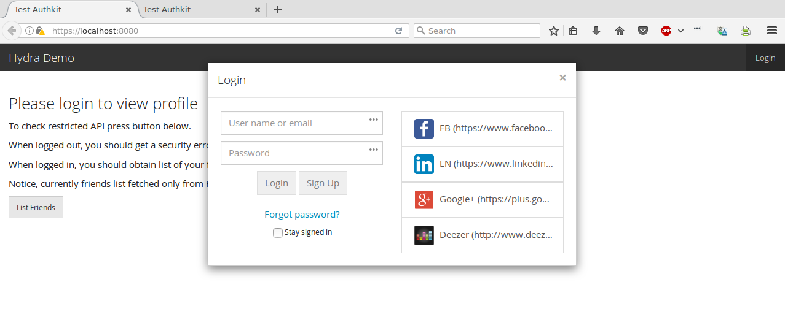
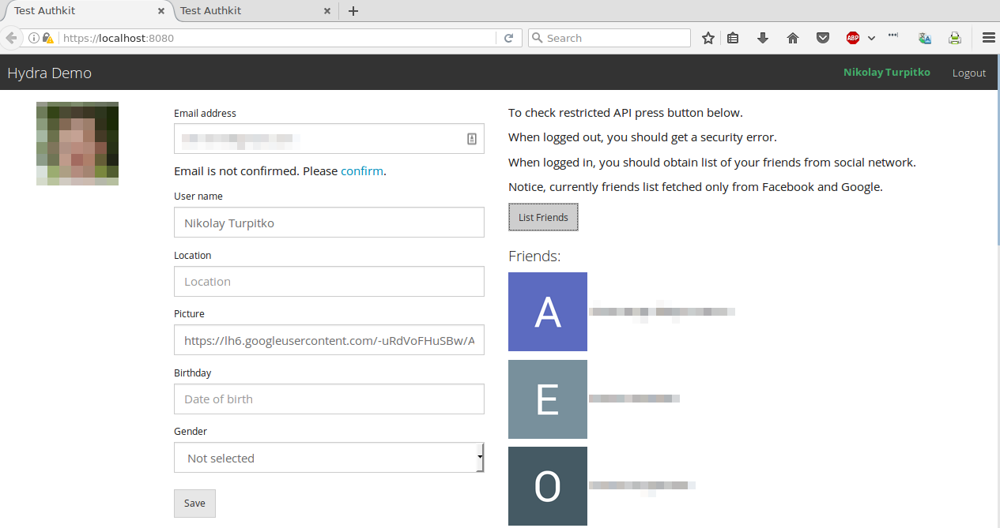
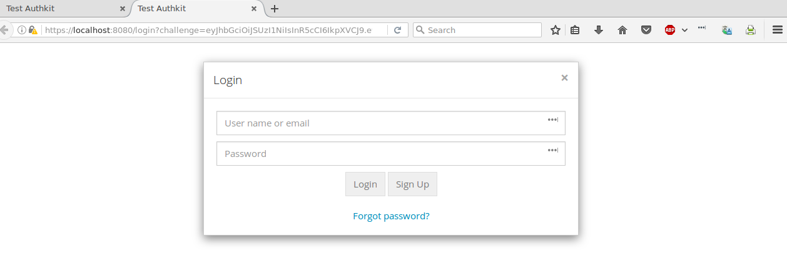

# sample/authkit

This sample uses:
- `authkit` to implement login logic;
- `echo` for routing, etc;
- `mongodb` to implement required storages;
- `hydra` as OAuth2 provider;

Use `make up` to start docker containers and the app, `make down` - to stop them.

See Makefile and app's settings for exact URLs.

App demonstrates login via Facebook, LinkedIn or Hydra.

Hydra is an open-source on-premise OAuth2 provider app.
You can run it at your site and it will allow you to be your own OAuth2 provider
and to grant access to your app's web API to your own client apps or to
third-party clients. Much like Google or Github do.

This app also demonstrates login scenario from third-party point of view (demo
app's consent page, which third-party app users would see, when login into the
third-party app using their logins, created at this demo).
This scenario starts from `https://localhost:8080/oauth2/auth?...` URL.

_Note_: we used the same internal client for third-party scenario's URL.
Actually, new client should be created for every third-party app.
Third-party should give us a redirect URL for the client and
we should respond with client_id and client_secret. Then third-party would be
able to construct correct URL to login, acquire our access token and make
requests to our API.

_Note_: to automate test app setup, we use insecure Hydra settings - options to 
suppress TLS verification and to enable autologon (human interaction required
otherwise). Also, all client secrets in the sample configuration file are
compromised. It's OK for demo app, but should not be used in production.

_HINT_: use `make down up ARGS="-dbg"` to resturt app with debug log.

## Configuration

1. Create TLS keys to enable https in browser.  
    
        cd ./backend/env
        openssl req -x509 -nodes -newkey rsa:2048 -keyout dev-server.key -out dev-server.crt -days 3650
    
2. Prepare GMail account, to use password confirmations.
3. Prepare Facebook and LinkedIn developer accounts and setup test applications
   in them with OAuth2 enabled.
4. Use sample configuration file as template and provide secrets
   (search for "xxx" pattern).

        cp ./backend/env/dev-sample.yaml ./backend/env/dev.yaml
        vim ./backend/env/dev.yaml

_Note_: we will be surprised if this sample happened to work in any version of IE.
If it does, it is purely coincidental, because we have no resources to support it.
We test it mostly in recent versions of FF and less rigorously in Chromium and Opera.

## Screenshots

At https://localhost:8080 you should see an app with "Login" button
at the left side of navigation menu. When it clicked, login dialog should appear.

Of course, initially database is empty, you cannot login, but can create a
new account. You may use existing email address, or arbitrary login.
To test password recovery you may enter your email later at the profile page.
Uppon account creation, profile page will be displayed.

Consent page (as if you were redirected to this sample from third-party site
to login via this app) shown below.

